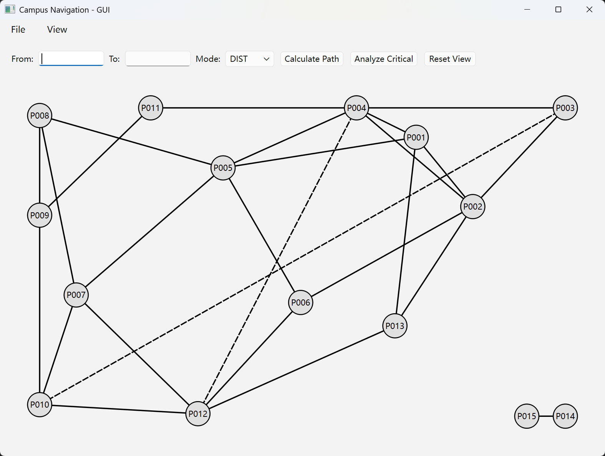
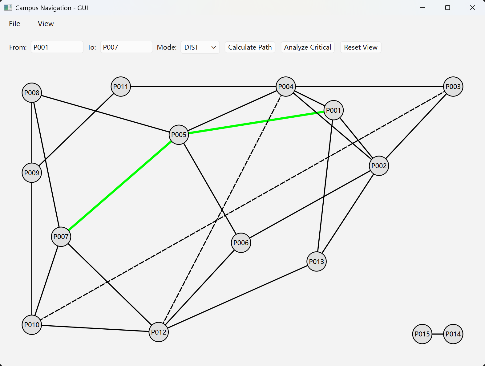
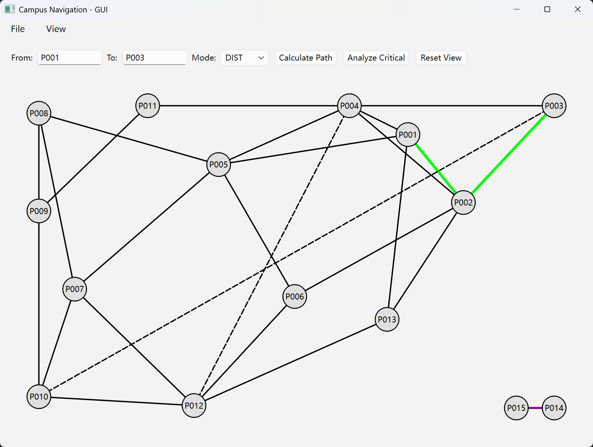
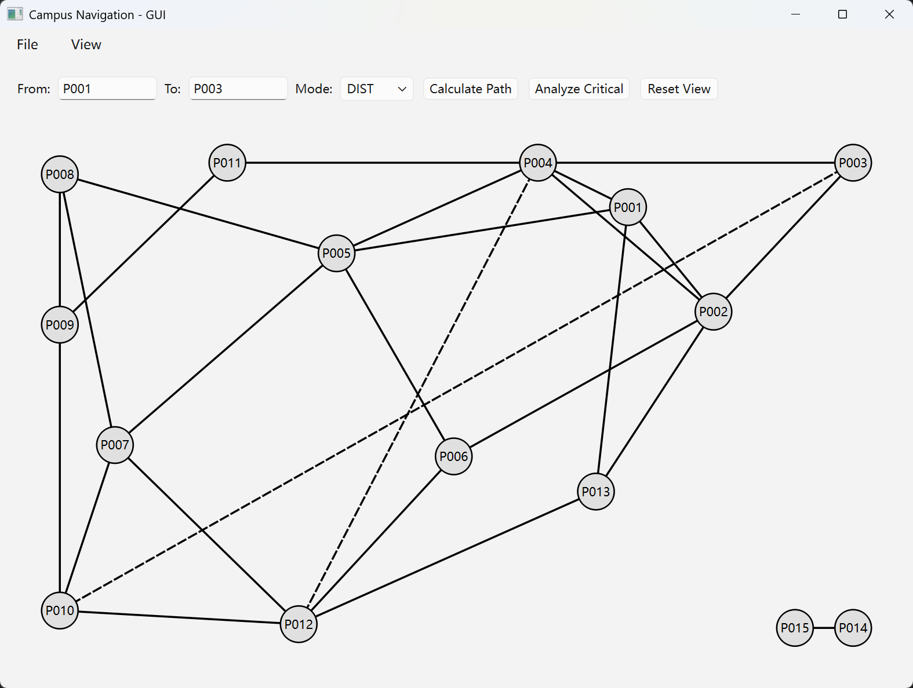
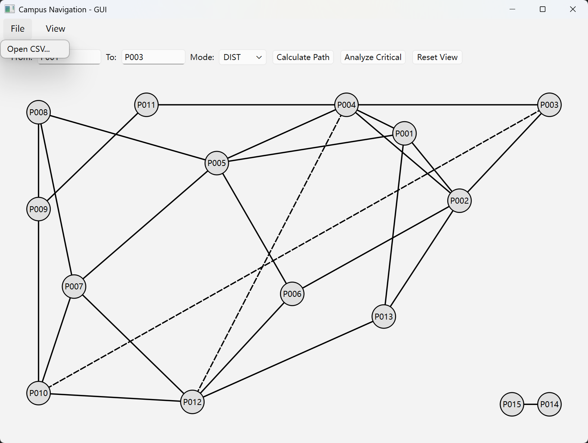

# GUI 用户指南

> 本文档说明 CampusNavigation GUI 版本的编译、运行和操作方式。

---

## 1. 依赖

| 依赖 | 版本 | 说明 |
|------|------|------|
| Qt 6 | 6.x (Widgets 模块) | GUI 框架，MinGW 64-bit |
| MinGW | GCC 13.1.0（Qt 自带） | 必须与 Qt 预编译二进制 ABI 一致 |
| CMake | ≥ 3.19（presets 支持） | 系统的 CMake 4.3.2 或 Qt 自带 CMake 均可 |

> 本项目另有一套 MinGW GCC 10.3.0 用于 CLI 编译。两个编译器通过 `CMakePresets.json` 自动区分，无需手动切换 PATH。

---

## 2. 编译与运行

```bash
# GUI 版本
cmake --preset gui
cmake --build build-gui
./build-gui/CampusNavigation.exe --gui

# CLI 版本（无 Qt 依赖）
cmake --preset default
cmake --build build
./build/CampusNavigation.exe

# 测试
ctest --test-dir build --output-on-failure
```

> 无需设置环境变量。Qt 路径已硬编码在 `CMakePresets.json` 的 `gui` preset 中。在其他机器上使用时，编辑该文件中的 `CMAKE_PREFIX_PATH`、`CMAKE_CXX_COMPILER` 路径即可。

---

## 3. 界面概览

```
┌─ File ── View ───────────────────────────────────────────┐
│ [Open CSV...]    [Reset Highlights]                        │
├───────────────────────────────────────────────────────────┤
│ From: [____] To: [____] Mode: [DIST ▼]                    │
│ [Calculate Path] [Analyze Critical] [Reset View]           │
├───────────────────────────────────────────────────────────┤
│                                                           │
│              ○ P001 ──── ○ P002 ──── ○ P003               │
│               │                       │                   │
│               │  黑色实线 = open       │                   │
│               │  黑色虚线 = closed     │                   │
│               │  绿色粗线 = 路径高亮    │                   │
│               │  紫色粗线 = 关键边      │                   │
│               │                       │                   │
│              ○ P004 ──── ○ P005 ──── ○ P006               │
│                                                           │
└───────────────────────────────────────────────────────────┘
```

- **菜单栏**：File → Open CSV（加载数据）、View → Reset Highlights（清除高亮）
- **控制栏**：起点/终点输入、模式选择、功能按钮
- **画布**：力导向布局的节点-边图，支持高亮叠加

---

## 4. 操作说明

### 4.1 加载数据

1. **File → Open CSV...**
2. 选择 `places.csv` → 确定
3. 选择 `roads.csv` → 确定

画布自动刷新：15 个节点按力导向布局排列，`open` 边黑色实线，`closed` 边黑色虚线。

> 测试数据：`test_data/custom/places.csv` + `test_data/custom/roads.csv`（15 节点，26 条道路，24 open + 2 closed）

### 4.2 计算最短路径

1. 在 **From** 输入起点 ID（如 `P001`）
2. 在 **To** 输入终点 ID（如 `P007`）
3. **Mode** 选择 `DIST`（距离优先）或 `TIME`（时间优先）
4. 点击 **Calculate Path**

最短路径以**绿色粗线**高亮。若不可达则弹窗提示 `No path`。

> 示例：P001→P007 (DIST) → 绿色线高亮 P001-P005-P007（400m）

### 4.3 分析关键节点/边

1. 点击 **Analyze Critical**

关键边（桥）以**紫色粗线**高亮，关键节点（割点）外圈**红色加粗**。

> 示例：custom 数据中 P014-P015 是唯一的桥边，断开后 P014/P015 子图将脱离主图。

### 4.4 清除高亮

- 点击 **Reset View** 按钮，或
- **View → Reset Highlights** 菜单

清除所有路径和关键高亮，恢复基础视图。加载新 CSV 数据时也会自动清除。

---

## 5. 代码结构

```
src/
├── main.cpp                    # 入口：--gui → runGui() / 否则 CLI
├── gui_main.cpp                # runGui(): 创建 QApplication + MainWindow
├── gui/
│   ├── MainWindow.h/cpp        # 主窗口：菜单栏、控制栏、GraphWidget
│   ├── GraphWidget.h/cpp       # 图绘制组件：paintEvent 手绘节点/边/高亮
│   └── ForceLayout.h/cpp       # Fruchterman-Reingold 力导向布局算法
```

### 核心类职责

| 类 | 职责 |
|------|------|
| `MainWindow` | 菜单栏（File/View）、控制栏（输入框/按钮）、插座转发到 GraphWidget |
| `GraphWidget` | QWidget 子类，`paintEvent` 手绘：坐标变换 → 边 → 节点 → 标签 → 高亮 |
| `ForceLayout` | `static compute(LGraph&, w, h) → QHash<id, QPointF>`，70 次迭代 |

### 算法复用

```cpp
// 最短路径
PathResult r = dijkstra(graph, from, to, weightFn);   // Algorithm.h
graphWidget->setPathNodes(r.nodes);

// 关键分析
CriticalResult cr = computeCritical(graph);            // Algorithm.h
graphWidget->setCritical(cr.nodes, cr.edges);

// 数据加载
loadPlaces(graph, "places.csv", err);                  // CsvIO.h
loadRoads(graph, "roads.csv", err);                    // CsvIO.h
```

### 绘制优先级（paintEvent 顺序）

| 元素 | 样式 | 说明 |
|------|------|------|
| open 边 | 黑色实线, w2 | 先绘制 |
| closed 边 | 黑色虚线, w2 | 仅线条样式区分 |
| 关键边（非路径）| 紫色实线, w3 | 仅当非路径边时 |
| 路径边 | 绿色实线, w4 | 最高边优先级 |
| 普通节点 | `#E0E0E0` 填充 + 黑边框 r=18px | |
| 关键节点 | 红色粗边框 | 叠加在节点样式之上 |

---

## 6. 效果截图

> 截图保存于 `docs/gui_screenshots/` 目录。

| 编号 | 截图 | 说明 | 链接 |
|------|------|------|------|
| 01 | 基础视图 | 加载 custom 数据后的力导向布局，open/closed 边 |  |
| 02 | 路径高亮 | P001→P007 DIST 最短路径，绿色粗线 |  |
| 03 | 关键分析 | 紫色桥边 P014-P015 + 红色关键节点边框 + 路径共存 |  |
| 04 | 重置视图 | 点击 Reset View 清除所有高亮后恢复基础视图 |  |
| 05 | 菜单功能 | File 菜单和 View 菜单的完整菜单项展示 |  |

---

## 7. 常见问题

**Q: `cmake --preset gui` 报错找不到 Qt6**

CMakePresets.json 中的 Qt 路径与当前机器不匹配。编辑文件，将 `CMAKE_PREFIX_PATH`、`CMAKE_C_COMPILER`、`CMAKE_CXX_COMPILER` 改为本机 Qt 安装路径。

**Q: 运行时提示缺少 DLL**

正常情况下不会出现——CMakeLists.txt 配置了 `windeployqt` 作为编译后步骤。如果手动移动了 exe，重新 `cmake --build build-gui` 即可自动修复。

**Q: 窗口显示但无节点**

尚未加载 CSV 数据。点击 File → Open CSV... 选择数据文件。
